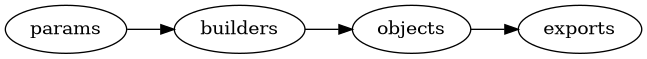

# What is this?

The General Geometry Description (GGD) is a software system to generate a description of a [constructive solid geometry](http://en.wikipedia.org/wiki/Constructive_solid_geometry) specifically as used by [Geant4](http://geant4.web.cern.ch/geant4/G4UsersDocuments/UsersGuides/ForApplicationDeveloper/html/Detector/geometry.html) or [ROOT](http://root.cern.ch/root/html534/guides/users-guide/Geometry.html) applications are as represented in [GDML](http://cern.ch/gdml) files. It is implemented as a pure Python module `gegede`.


# Install

GeGeDe may be installed in any of the "usual" ways and in particular via [uv](https://docs.astral.sh/uv/).

Not installing:

```
uvx gegede
```

More persistent

```
uv tool install gegede
gegede
```

See the [installation](./doc/install.md) document for details and other ways to install.


# How do I use it?

GGD is designed along layers each of which allows the user-programmer access.



-   **params:** high level, human-centric configuration mechanism
-   **builders:** structured, procedural geometry constructor code
-   **objects:** the in-memory representation of the final geometry
-   **export:** conversion to formats suitable to exchange the data with other applications.

At the highest level is a simple configuration language for end-user setting of parameters that are consumed by the next layer, the builders. The builders are instances of classes which are responsible for constructing some portion of an overall geometry. They may also manage some number of other (sub)builders to handle specific construction details. The geometry is constructed by building an in-memory representation of general geometry objects. Finally these objects may be exported into a number of forms including GDML, "plain old (Python) data" and JSON. Each layer provides for extension to novel uses.


# Tutorial

Each layer contains a tutorial:

-   [Configuration](./doc/configuration.md)
-   [Builders](./doc/builders.md)
-   [Construction](./doc/construction.md)
-   [Exporting](./doc/exporting.md)

See also the [GeGeDe Example](https://github.com/brettviren/gegede-example) project.


# Reference

T.B.D.


# GeGeDe Users

-   [DUNE GGD](https://github.com/DUNE/duneggd) geometries for DUNE (far) detectors.
-   [DUNE ND GGD](https://github.com/DUNE/dunendggd) geometries for (some) DUNE near detectors
-   [GeGeDe Examples](https://github.com/brettviren/gegede-example)
