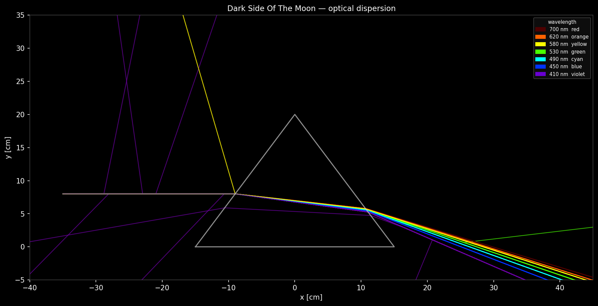

#+TITLE: Optical Prism — GeGeDe + Geant4 Example

This example builds a simple optical detector geometry using GeGeDe and
exports it to GDML.  A minimal Geant4 C++ application in =g4app/= can then
read the GDML and report the geometry and optical surfaces it contains.

* Geometry

#+BEGIN_EXAMPLE
  world_vol  (1 m cube, StainlessSteel)
    └─ air_vol  (90 cm cube, Water, centred)
         ├─ prism_vol  (triangular glass prism, Glass, centred)
         └─ pmt_vol    (×384 PMT hemispheres, pmt_glass, on 6 faces)
#+END_EXAMPLE

The triangular prism has a 30 cm base, 20 cm height and 20 cm depth.
It is shaped with ~ExtrudedOne~ using three polygon vertices.

Each PMT is a hemisphere (=rmax= 5 cm, =dtheta= 90°) placed on a square grid
with 10 cm spacing on every inner face of the air volume.  Grid positions run
from −35 cm to +35 cm (8 per transverse axis, 64 per face, 384 total).  The
outermost positions are kept at ±35 cm rather than ±40 cm to prevent the PMT
domes from overlapping in the 8 corner regions of the air box (see the module
docstring in =optical.py= for the geometric argument).

All 384 PMT placements share the single logical volume =pmt_vol=, which is
marked as a sensitive detector via the GDML =<auxiliary>= tag.

* Optical properties

| Material / Surface    | Property     | Values                                                            |
|-----------------------+--------------+-------------------------------------------------------------------|
| Water                 | RINDEX       | 1.331–1.353 (Sellmeier dispersion, 700–300 nm)                    |
| Water                 | ABSLENGTH    | 1–70 m (peak at 400–500 nm, poor in red and UV) [mm in GDML]     |
| Water                 | RAYLEIGH     | 3–750 m (λ^4 scaling, ~15 m at 400 nm) [mm in GDML]             |
| Glass (prism)         | RINDEX       | 1.60 (flat approximation)                                         |
| pmt_glass             | RINDEX       | 1.50 (borosilicate window approximation)                          |
| StainlessSteel walls  | REFLECTIVITY | 0.90 @ 2.034 eV, 0.85 @ 4.136 eV                                 |
| PMT photocathode      | REFLECTIVITY | 0.0 (all absorbed; must be set — absent defaults to 1.0 in Geant4) |
| PMT photocathode      | EFFICIENCY   | 0.05 @ 2.034 eV, 0.25 @ 3.06 eV, 0.08 @ 4.136 eV                 |

The steel–air boundary is described by an ~OpticalSurface~ (model
=unified=, finish =polished=, type =dielectric_metal=) and a
~BorderSurface~ referencing the =air_in_steel= placement.

The PMT photocathode is described by a second ~OpticalSurface~ (same model /
finish / type) with an =EFFICIENCY= property representing the quantum
efficiency of a bialkali photocathode typical for water Cherenkov detectors
(e.g. Hamamatsu R7081).  A ~SkinSurface~ applying this surface to =pmt_vol=
covers all 384 physical instances automatically.

** Note on energy/value property rows

Material and surface optical properties use the =(energy_eV, value)= pair
convention.  In the Python source the rows are expressed as plain-float
2-tuples (energy in eV, value in the appropriate unit).  Geant4 interprets
the matrix =coldim="2"= entries as energy/value pairs.  Because GDML
matrices carry no units, callers must supply values already in the unit
Geant4 expects:

- Photon energies: *eV*
- Dimensionless properties (RINDEX, REFLECTIVITY, EFFICIENCY): plain float
- Length properties (ABSLENGTH, RAYLEIGH): *mm* (Geant4's internal length unit)

So an absorption mean free path of 70 m must be written as =70000= (mm) in
the Python source.

A *flat list* of scalars may also be used for single-value (scalar)
properties; this produces =coldim="1"=.

** GDML sensitive-detector marking

In GDML, a logical volume is marked as a sensitive detector with the
=<auxiliary>= child element:

#+BEGIN_SRC xml
<volume name="pmt_vol">
  <materialref ref="pmt_glass"/>
  <solidref ref="pmt_hemi"/>
  <auxiliary auxtype="SensDet" auxvalue="PMTDetector"/>
</volume>
#+END_SRC

In GeGeDe this is expressed through the =params= keyword of
~geom.structure.Volume~:

#+BEGIN_SRC python
pmt_vol = geom.structure.Volume(
    "pmt_vol",
    material = "pmt_glass",
    shape    = "pmt_hemi",
    params   = [("SensDet", "PMTDetector")])
#+END_SRC

Each =(auxtype, auxvalue)= pair in =params= produces one =<auxiliary>= element.
The =auxtype= / =auxvalue= strings are passed through unchanged; GeGeDe places
no constraint on their values.

* Files

| File           | Description                                 |
|----------------+---------------------------------------------|
| =optical.py=   | GeGeDe builder class and standalone script  |
| =optical.cfg=  | GeGeDe configuration (used by the CLI)      |
| =run.sh=       | Shell script that calls the gegede CLI      |
| =g4app/=       | Minimal Geant4 C++ reader application       |

* Generating the GDML

Run from this directory.  The script sets =PYTHONPATH= so that =optical.py=
is importable.

#+BEGIN_SRC sh
./run.sh
#+END_SRC

Alternatively, use the Python entry point directly:

#+BEGIN_SRC sh
PYTHONPATH=. python optical.py optical_prism.gdml
#+END_SRC

Or drive it yourself via the gegede CLI:

#+BEGIN_SRC sh
PYTHONPATH=. gegede -o optical_prism.gdml optical.cfg
#+END_SRC

All three produce the same =optical_prism.gdml= output.

* Building and running the Geant4 application

Geant4 must be built with GDML support (=GEANT4_USE_GDML=ON=, which
requires Xerces-C).  The application is not built as part of the gegede
build system; it is a standalone CMake project.

#+BEGIN_SRC sh
# Generate the GDML first
./run.sh

# Configure and build
cmake -S g4app -B g4app/build \
      -DGeant4_DIR=/path/to/geant4/lib/cmake/Geant4
cmake --build g4app/build
#+END_SRC

** Running a simulation

The default run fires 1000 optical photons from the centre of the air
volume, isotropically, with a flat energy spectrum across 1.77–4.14 eV
(700–300 nm):

#+BEGIN_SRC sh
cd g4app/build
./optical_g4
#+END_SRC

Both arguments are optional:

#+BEGIN_SRC sh
./optical_g4 [macro.mac] [path/to/optical_prism.gdml]
#+END_SRC

Defaults (relative to =g4app/build/=):

| Argument | Default                      |
|----------+------------------------------|
| macro    | =macros/run.mac=             |
| GDML     | =../../optical_prism.gdml=   |

Environment variables =OPTICAL_MACRO=, =OPTICAL_GDML=, and
=OPTICAL_OUT_DIR= (output directory, default cwd) override defaults.

Two macro files are provided in =g4app/macros/=:

| File            | Description                                      |
|-----------------+--------------------------------------------------|
| =run.mac=       | 1000 events, no trajectory storage (fast)        |
| =run_traj.mac=  | 50 events with =/tracking/storeTrajectory 1=     |

Use =run_traj.mac= when you also want to visualise photon paths.  You can
write your own macro to change the beam shape, energy, or position; pass
it as the first argument.

At start-up the application prints the volume tree, materials, border
surfaces, and skin surfaces as a diagnostic banner (same as the original
read-only inspector).

** Output files

Two CSV files are written to the current directory (or =$OPTICAL_OUT_DIR=):

*** =hits.csv= — one row per PMT detection

A photon is recorded when =G4OpBoundaryProcess= reports =Detection=
status, meaning it was absorbed by the photocathode and passed the
quantum-efficiency roll.

| Column          | Description                          |
|-----------------+--------------------------------------|
| =event_id=      | Geant4 event number                  |
| =hit_id=        | Index within the event               |
| =pmt_name=      | Logical volume name (=pmt_vol=)      |
| =copyno=        | Physical volume copy number          |
| =x_cm=          | Hit position x [cm]                  |
| =y_cm=          | Hit position y [cm]                  |
| =z_cm=          | Hit position z [cm]                  |
| =t_ns=          | Arrival time [ns]                    |
| =energy_eV=     | Photon energy at detection [eV]      |
| =wavelength_nm= | Corresponding wavelength [nm]        |

*** =trajectories.csv= — one row per trajectory point (optional)

Only populated when =/tracking/storeTrajectory 1= is set in the macro
(e.g. =run_traj.mac=).  The file is always created but may contain only
the header row if trajectory storage is off.

| Column      | Description                             |
|-------------+-----------------------------------------|
| =event_id=  | Geant4 event number                     |
| =track_id=  | Track ID within the event               |
| =parent_id= | Parent track ID (0 = primary)           |
| =pdg=       | PDG particle code (20022 = opt. photon) |
| =point_idx= | Step-point index along the track        |
| =x_cm=      | Position x [cm]                         |
| =y_cm=      | Position y [cm]                         |
| =z_cm=      | Position z [cm]                         |

** Plotting

A Python script in =g4app/python/plot_hits.py= draws a 3-D figure with:

- grey wireframe of the steel world box,
- blue wireframe of the air volume,
- gold wireframe of the glass prism (read from the GDML),
- PMT hits as a scatter plot coloured by arrival time (viridis),
- photon trajectories as faint poly-lines (when =trajectories.csv= is present).

#+BEGIN_SRC sh
# From g4app/build/ after running ./optical_g4:
uv run python ../python/plot_hits.py --out hits.png

# With trajectories (run_traj.mac first):
./optical_g4 macros/run_traj.mac ../../optical_prism.gdml
uv run python ../python/plot_hits.py --traj trajectories.csv --out traj.png

# Dark Side of the Moon demo
./optical_g4 macros/dsotm.mac optical_prism.gdml
uv run python g4app/python/plot_traj.py \
      --traj trajectories.csv --gdml optical_prism.gdml \
      --view dsotm --out dsotm.png
#+END_SRC

Dependencies: =pandas=, =numpy=, =matplotlib=, =lxml= (already a gegede
requirement — no new packages).

** Note on Geant4 internal visualisation

Geant4-internal visualisation drivers (OpenGL/Qt, VRML, HepRep) are not
wired up in this iteration because they require a Qt or display
dependency.  When that dependency becomes acceptable, enabling it is a
small diff: add =find_package(Geant4 REQUIRED ui_all vis_all)= to
=CMakeLists.txt= and register a =G4VisExecutive= / =G4UIExecutive= in
=main.cc=.  No class changes are needed.

** Example inspector output (abbreviated)

#+BEGIN_EXAMPLE
Macro: macros/run.mac
GDML : ../../optical_prism.gdml

=== Volume tree ===
world_vol_PV  [StainlessSteel]
  air_in_steel  [Air]
    prism_in_air  [Glass]
    pmt_pz_0_0  [pmt_glass]
    pmt_pz_0_1  [pmt_glass]
    pmt_pz_0_2  [pmt_glass]
    ... (381 more daughters not shown)

=== Materials ===
  StainlessSteel  density=8 g/cm3
  Air  density=0.00129 g/cm3  optical-props: RINDEX
  Glass  density=2.2 g/cm3  optical-props: RINDEX
  pmt_glass  density=2.2 g/cm3  optical-props: RINDEX

=== Border surfaces ===
  air_steel_border
    pv1: air_in_steel
    pv2: air_in_steel
    surface-props: REFLECTIVITY

=== Skin surfaces ===
  pmt_skin  lv: pmt_vol

  [SD] attached PMTDetector to pmt_vol

--- Run summary ---
  Events  : 1000
  PMT hits: 847
  Traj pts: 0
  Output  : hits.csv, trajectories.csv
#+END_EXAMPLE

The volume tree printout caps at depth 3 and shows at most 4 daughters per
node to keep the output readable when many placements are present.
